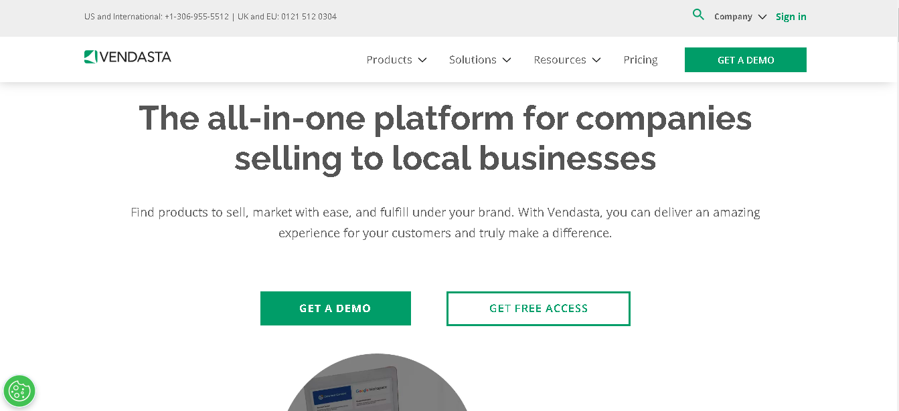
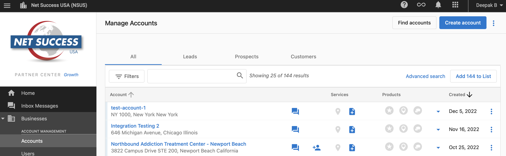
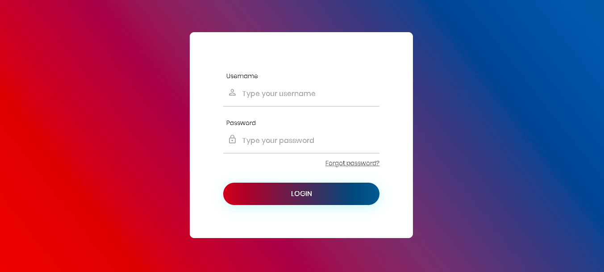

# SEO Report 1.0

> This is SEO Report Project (version 1).
> Live demo [_here_](https://www.vendasta.com). <!-- If you have the project hosted somewhere, include the link here. -->

## Table of Contents

- [General Info](#general-information)
- [Technologies Used](#technologies-used)
- [Features](#features)
- [Screenshots](#screenshots)
- [Setup](#setup)
- [Usage](#usage)
- [Project Status](#project-status)
- [Room for Improvement](#room-for-improvement)
- [Acknowledgements](#acknowledgements)
- [Contact](#contact)
<!-- * [License](#license) -->

## General Information

- In this project, clients can see SEO Reports such as ranking keywords of different search engines.
- Clients can easily see & download SEO reports.
- Link website as product of vendasta platform.
- The reason why I undertook this is the project requires complicated API Integration.
<!-- You don't have to answer all the questions - just the ones relevant to your project. -->

## Technologies Used

- Tech 1 - PHP
- Tech 2 - Vendasta Development API Integration
- Tech 3 - SSO Login

## Features

List the ready features here:

- Vendasta Platform Link Support
- SSO Login using OAuth2

## Screenshots

<!-- If you have screenshots you'd like to share, include them here. -->

## Setup

Project uses PHP & MySQL so only need of XAMPP environment.
Set the document root of apache as this project path.

## Usage

Enter vendasta platform.
Impersonate one account and click product link to access website.
This is SSO Login so you can login directly.

## Project Status

Project is: _complete_.

## Room for Improvement

Theses are need improvement & could be improved. Also TODOs for future development.

Room for improvement:

- PHP Skill
- API Integration

To do:

- Some featues will be added on 2nd Project
- Bug fix

## Acknowledgements

Give credit here.

- This project was inspired by Deepak Bansal.
- This project was based on [this tutorial](https://developers.vendasta.com).
- Many thanks to Deepak Bansal.

## Contact

Created by [@violetstar701](https://www.flynerd.pl/) - feel free to contact me!

<!-- Optional -->
<!-- ## License -->
<!-- This project is open source and available under the [... License](). -->

<!-- You don't have to include all sections - just the one's relevant to your project -->
